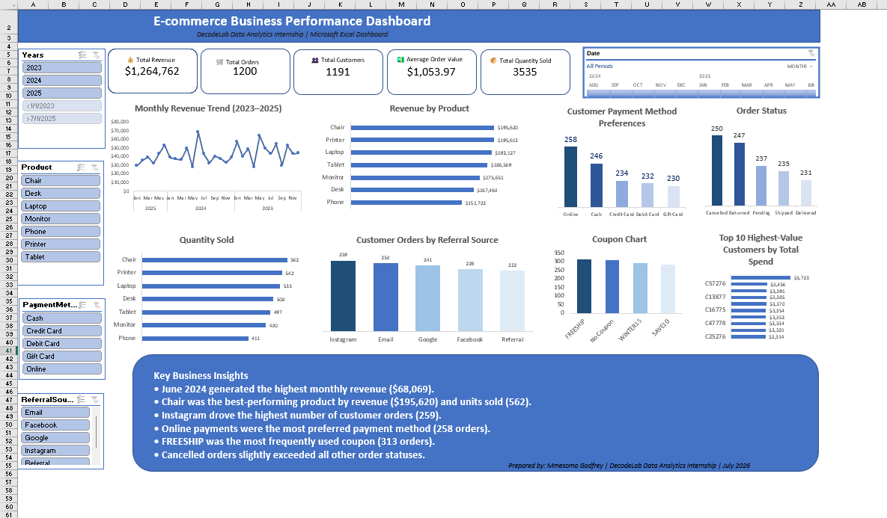

# Week 1: E-commerce Data Analysis

## Project Overview

This project focuses on analyzing an e-commerce dataset using Microsoft Excel. The objective was to clean the data, perform exploratory analysis, calculate key performance indicators (KPIs), create PivotTables and charts, and build an interactive dashboard to provide business insights.

---

## Objectives

- Clean and prepare the dataset
- Analyze sales performance
- Identify top-performing products
- Evaluate customer purchasing behavior
- Build an interactive Excel dashboard
- Generate actionable business insights

---

## Tools Used

- Microsoft Excel
- PivotTables
- PivotCharts
- Slicers
- Dashboard Design

---

## Key Insights

- June 2024 generated the highest monthly revenue.
- Chair produced the highest revenue and the highest quantity sold.
- Instagram was the leading referral source.
- Online payment was the most preferred payment method.
- FREESHIP was the most frequently used coupon.
- Cancelled orders slightly exceeded other order statuses, indicating an opportunity to improve order fulfillment.

---

## Skills Demonstrated

- Data Cleaning
- Exploratory Data Analysis (EDA)
- KPI Development
- Dashboard Design
- Business Intelligence
- Data Visualization

---
- Files
- Chart_Project_1.png
- Pivot_Table_Project_1.png
## Dashboard Preview
The dashboard provides an interactive overview of the e-commerce dataset, highlighting key business metrics such as revenue, profit, customer behavior, product performance, and sales trends.

